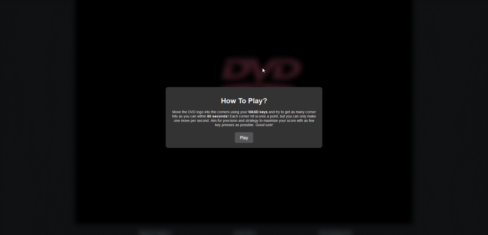

# Still-Waiting

### You can play the game [**here**](https://stillwaiting.fun/)

> ***Who knew a graphic could be cheeky?***
>
> 
- Jazz Emu

## How to Play   
Use the WASD keys to move the DVD logo into a corner. You will need precision and good timing to do it since you can make one move every second. The objective is to maximize corner hits while minimizing key presses within a 60-second timeframe.

## Description
This DVD logo game, built with Defold, features a dynamically moving logo that bounces off screen edges, with sound effects for bounces and corner hits. It includes random initial positioning and direction, and collision detection with edge tolerance.

Additionally, the integrated HTML interface displays a game description at the beginning, and the achieved score and scoreboard at the end with the options to submit the score and play again. If a player tries to move in a new direction too quickly, a pop-up reminder about the 1-second restriction will appear. Scores, including players' initials, key presses, and timestamps, are stored in a SQL database.

To submit a score, the player must enter their initials (up to 6 characters) and achieve a score greater than zero. The score will be saved in the database even if it does not appear on the high score board. If a player achieves a new high score, or matches a previous high score with fewer key presses, a pop-up with a star animation will be triggered, congratulating them on their achievement. Otherwise, no action will occur, and any submission of a poorer result will not be stored in the database.

I wanted to familiarise myself with Lua so I made this game over the course of 5 days with this [song](https://www.youtube.com/watch?v=_ws0QtAiiXQ) as my source of inspiration. **Note that this game is a work in progress**

## Latest Additions
- Highscore Board: A real-time leaderboard showcases the top 10 players, made possible through by SQL database integration.
- Personal Best Alerts: On achieving a new personal best, players are greeted with a celebratory on-screen animation.
- Improved UI: Displaying scores, highscores, and game instructions.

## Possible Future Additions  
- Levels
- Obstacles

